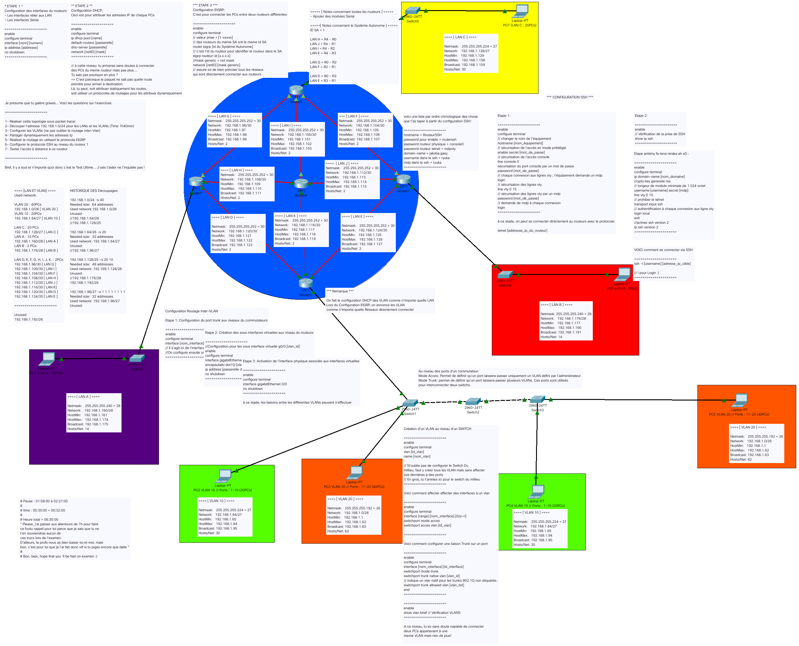

# training-packet-tracer

```script
/*****************************************************************/
/*  ____            _        _     _____                         */
/* |  _ \ __ _  ___| | _____| |_  |_   _| __ __ _  ___ ___ _ __  */
/* | |_) / _` |/ __| |/ / _ \ __|   | || '__/ _` |/ __/ _ \ '__| */
/* |  __/ (_| | (__|   <  __/ |_    | || | | (_| | (_|  __/ |    */
/* |_|   \__,_|\___|_|\_\___|\__|   |_||_|  \__,_|\___\___|_|    */
/*                                                               */
/*****************************************************************/
```

## Introduction

```script
 __________________________
< Hello World! C'est Ryuka >
 --------------------------
        \   ^__^
         \  (oo)\_______
            (__)\       )\/\
                ||----w |
                ||     ||
```

Suite à l'examen du première session de notre module "Introduction aux système et réseaux informatique"; j'ai réaliser ci-joint une petite laboratoire qui permet de réviser tout les notions essentiels et utile à l'examen

## Contenu



## Disclaimer

```script
 _________________________________________
( Le .pkt as été réaliser sous la version )
( 7.3.1, mais je doute qu'il y a une      )
( incompatibilité avec les autres         )
( versions.... Contactez moi si vous avez )
( bésoins d'aide ou démander à un         )
( compétent dans votre entourage, je      )
( pense que la plus part des commandes    )
( traiter sont de niveaux facile.         )
 -----------------------------------------
        o   ^__^
         o  (oo)\_______
            (__)\       )\/\
                ||----w |
                ||     ||
```
